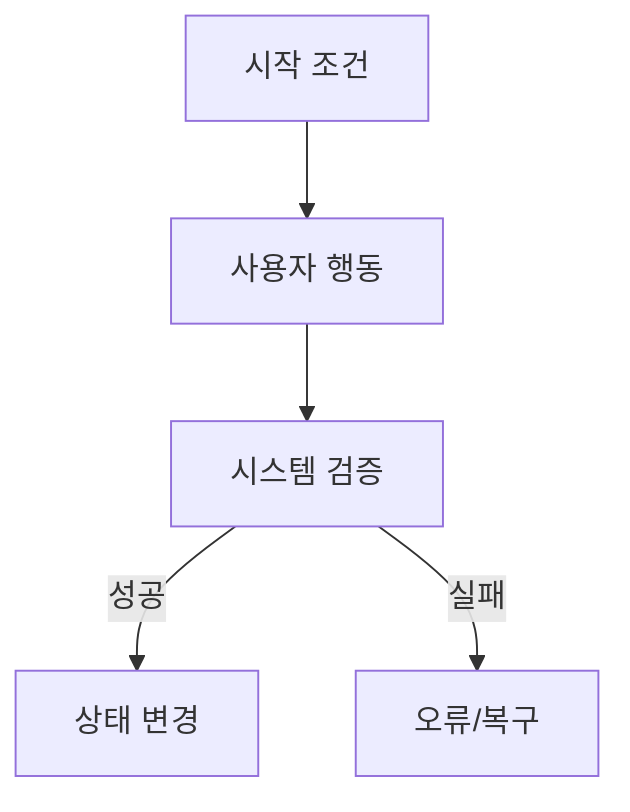

# Planning Artifact Template

이 문서는 기획 산출물에 포함할 항목과 작성 기준을 정의한다.

## 목적

기획 산출물은 구현 세부사항을 정하는 문서가 아니라, 현실 업무를 시스템이 처리할 수 있는 흐름과 정책으로 고정하는 문서다.

## 필수 산출물

### 요구사항 요약

- 목표: 사용자가 얻어야 하는 결과를 한 문장으로 쓴다.
- 범위: 이번 구현에 포함할 업무 결과만 쓴다.
- 제외사항: 하지 않을 일을 명시한다.
- 성공 기준: 구현 완료 후 확인할 사용자 관점 조건을 쓴다.

### 행위자와 권한

- 업무를 시작하는 사용자 또는 시스템
- 승인, 검토, 조회, 수정, 취소 권한
- 권한이 없을 때의 시스템 반응

### 업무 흐름도

Mermaid를 사용할 수 있으면 아래 형식을 기본값으로 사용한다.

### 업무 프로세스 모델

- 시작 조건
- 정상 흐름
- 대체 흐름
- 실패 흐름
- 종료 조건
- 후속 이벤트

### 도메인 모델과 용어 사전

- 핵심 도메인 용어
- 엔티티 또는 업무 개념
- 식별자와 핵심 속성
- 관계와 소유권
- 불변식

### 정책 정의서

정책은 아래 범주로 나눈다.

- 업무 규칙: 승인 조건, 계산 규칙, 제한 조건
- 권한 정책: 누가 어떤 상태에서 무엇을 할 수 있는가
- 검증 정책: 입력값, 중복, 필수값, 유효 기간
- 운영 정책: 감사 로그, 알림, 데이터 보존, 외부 연동
- 예외 정책: 실패, 취소, 반려, 재시도, 복구

### 상태 정의서

- 상태명과 의미
- 상태 소유자
- 상태 전이 trigger
- 전이 guard
- 전이 side effect
- terminal 상태
- rollback 또는 취소 가능성

### 화면 설계서

- 화면명과 목적
- 진입점과 종료점
- 주요 액션
- 표시 데이터
- loading, empty, success, error 상태
- 권한별 표시 차이
- 오류와 복구 액션
- 다음 화면 또는 navigation

## 추가 검토 산출물

아래 항목은 기능 성격에 따라 포함한다.

- 데이터 정의서: API DTO 전에 필요한 데이터 의미와 식별자 정의
- 감사·이벤트 정의: 누가, 언제, 무엇을 했는지 남겨야 하는 경우
- 알림 정의: 발송 조건, 대상, 중복 방지
- 외부 연동 정의: 외부 시스템 trigger, retry, timeout, fallback
- 비기능 요구사항: 성능, 보안, 접근성, 관측성, 운영 제약
- 인수 테스트 시나리오: 정상, 대체, 실패, 권한, 경계값

## 완료 점검

- 구현자가 질문 없이 정상 흐름과 실패 흐름을 구분할 수 있다.
- backend 설계자가 도메인 상태와 정책을 추출할 수 있다.
- frontend 설계자가 화면 상태와 사용자 액션을 추출할 수 있다.
- API 스펙 작성자가 command, query, event 후보를 추출할 수 있다.
- 남은 질문은 구현을 막는 질문인지 후속 세부화 질문인지 분류되어 있다.
